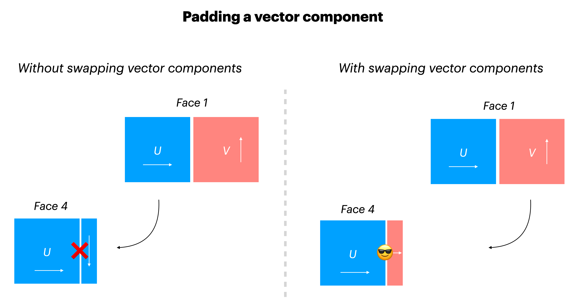

.. _grid_topology:

Grid Topology
-------------

.. warning::

    The features described in this page should be considered experimental. The
    API is subject to change. Please report any unexpected behavior or
    unpleasant experiences on the
    `github issues page <https://github.com/xgcm/xgcm/issues>`_

Faces and Connections
~~~~~~~~~~~~~~~~~~~~~

Simple grids, as described on the :ref:`grids` page, consist of a
single logically rectangular domain.
Many modern GCMs use more complex grid topologies, consisting of multiple
logically rectangular grids connected at their edges.
xgcm is capable of understanding the connections between these grid
*faces* and exchanging data between them appropriately.

.. figure:: images/cubed_sphere.jpeg
  :scale: 20 %
  :alt: Cubed Sphre Grid

  Example of a lat-lon-cap grid from the MIT General Circulation Model.
  Image credit `Gael Forget <http://www.gaelforget.net/>`_.
  More information about the simulation and grid available at
  https://doi.org/10.5194/gmd-8-3071-2015.

In order to construct such a complex grid topology, we need a way to tell
xgcm about the connections between faces. This is accomplished via the
``face_connections`` keyword argument to the ``Grid`` constructor.
Below we illustrate how this works with a series of increasingly complex
examples.
If you just want to get the detailed specifications for ``face_connections``,
jump down to :ref:`face_connections_spec`.

Examples
~~~~~~~~

Two Connected Faces
^^^^^^^^^^^^^^^^^^^

The simplest possible scenario is two faces connected at one side. Consider
the following dataset

.. ipython:: python

    import numpy as np
    import xarray as xr

    N = 25
    ds = xr.Dataset(
        {"data_c": (["face", "y", "x"], np.random.rand(2, N, N))},
        coords={
            "x": (("x",), np.arange(N), {"axis": "X"}),
            "xl": (
                ("xl"),
                np.arange(N) - 0.5,
                {"axis": "X", "c_grid_axis_shift": -0.5},
            ),
            "y": (("y",), np.arange(N), {"axis": "Y"}),
            "yl": (
                ("yl"),
                np.arange(N) - 0.5,
                {"axis": "Y", "c_grid_axis_shift": -0.5},
            ),
            "face": (("face",), [0, 1]),
        },
    )
    ds

The dataset has two spatial axes (``X`` and ``Y``), plus an additional dimension
``face`` of length 2.
Let's imagine the two faces are joined in the following way:

.. figure:: images/two_faces.png
  :alt: two connected faces

We can construct a grid that understands this connection in the following way

.. ipython:: python

    import xgcm

    face_connections = {
        "face": {0: {"X": (None, (1, "X", False))}, 1: {"X": ((0, "X", False), None)}}
    }
    grid = xgcm.Grid(ds, face_connections=face_connections)
    grid

The ``face_connections`` dictionary tells xgcm that ``face`` is the name of the
dimension that contains the different faces. (It might have been called
``tile`` or ``facet`` or something else similar.) This dictionary say that
face number 0 is connected along the X axis to nothing on the left and to face
number 1 on the right. A complementary connection exists from face number 1.
These connections are checked for consistency.

We can now use :py:meth:`grid.interp() <xgcm.Grid.interp>` and
:py:meth:`grid.diff() <xgcm.Grid.diff>` to correctly interpolate and difference
across the connected faces.

Two Faces with Rotated Axes
^^^^^^^^^^^^^^^^^^^^^^^^^^^

.. ipython:: python

    face_connections = {
        "face": {0: {"X": (None, (1, "Y", False))}, 1: {"Y": ((0, "X", False), None)}}
    }
    grid = xgcm.Grid(ds, face_connections=face_connections)
    grid

Cubed Sphere
^^^^^^^^^^^^

A more realistic and complicated example is a cubed sphere. One possible
topology for a cubed sphere grid is shown in the figure below:

.. figure:: images/cubed_sphere_face_connections.png
  :alt: cubed sphere face connections

This geometry has six faces. We can generate an xarray Dataset that has two
spatial dimensions and a face dimension as follows:

.. ipython:: python

    ds = xr.Dataset(
        {"data_c": (["face", "y", "x"], np.random.rand(6, N, N))},
        coords={
            "x": (("x",), np.arange(N), {"axis": "X"}),
            "xl": (
                ("xl"),
                np.arange(N) - 0.5,
                {"axis": "X", "c_grid_axis_shift": -0.5},
            ),
            "y": (("y",), np.arange(N), {"axis": "Y"}),
            "yl": (
                ("yl"),
                np.arange(N) - 0.5,
                {"axis": "Y", "c_grid_axis_shift": -0.5},
            ),
            "face": (("face",), np.arange(6)),
        },
    )
    ds

We specify the face connections and create the ``Grid`` object as follows:

.. ipython:: python

    face_connections = {
        "face": {
            0: {
                "X": ((3, "X", False), (1, "X", False)),
                "Y": ((4, "Y", False), (5, "Y", False)),
            },
            1: {
                "X": ((0, "X", False), (2, "X", False)),
                "Y": ((4, "X", False), (5, "X", True)),
            },
            2: {
                "X": ((1, "X", False), (3, "X", False)),
                "Y": ((4, "Y", True), (5, "Y", True)),
            },
            3: {
                "X": ((2, "X", False), (0, "X", False)),
                "Y": ((4, "X", True), (5, "X", False)),
            },
            4: {
                "X": ((3, "Y", True), (1, "Y", False)),
                "Y": ((2, "Y", True), (0, "Y", False)),
            },
            5: {
                "X": ((3, "Y", False), (1, "Y", True)),
                "Y": ((0, "Y", False), (2, "Y", True)),
            },
        }
    }
    grid = xgcm.Grid(ds, face_connections=face_connections)
    grid

For a real-world example of how to use face connections, check out the
`MITgcm ECCOv4 example`_.

.. _MITgcm ECCOv4 example: example_eccov4.ipynb

.. _face_connections_spec:

Face Connections Spec
~~~~~~~~~~~~~~~~~~~~~

Because of the diversity of different model grid topologies, xgcm tries to
avoid making assumptions about the nature of the connectivity between faces.
It is up to the user to specify this connectivity via the
``face_connections`` dictionary.
The ``face_connections`` dictionary has the following general stucture

.. code-block:: none

    {'<FACE DIMENSION NAME>':
        {<FACE DIMENSION VALUE>:
             {'<AXIS NAME>': (<LEFT CONNECTION>, <RIGHT CONNECTION>),
              ...}
        ...
    }

``<LEFT CONNECTION>>`` and ``<RIGHT CONNECTION>`` are either ``None`` (for no
connection) or a three element tuple with the following contents

.. code-block:: none

    (<FACE DIMENSION VALUE>, `<AXIS NAME>`, <REVERSE CONNECTION>)

``<FACE DIMENSION VALUE>`` tells which face this face is connected to.
``<AXIS NAME>`` tells which axis on that face is connected to this one.
``<REVERSE CONNECTION>`` is a boolean specifying whether the connection is
"reversed". A normal (non reversed) connection connects the right edge of one
face to the left edge of another face. A reversed connection connects
left to left, or right to right.

.. note::

  We may consider adding standard ``face_connections`` dictionaries for common
  models (e.g. MITgcm, GEOS, etc.) as a convenience within xgcm. If you would
  like to pursue this, please open a
  `github issue <https://github.com/xgcm/xgcm/issues>`_.

Working with Vectors and Connections
~~~~~~~~~~~~~~~~~~~~~~~~~~~~~~~~~~~~

Once the complex grid topology is set up with the proper ``face_connections`` dictionary
you can operate on it like any of the simpler grids if you are dealing with scalar fields
(e.g. any tracer). If you want to operate on vector fields, like velocities or transports,
some special care is needed.

Why is that the case? Lets consider a subset of the faces introduced above.
Specifically lets focus on the connection between faces 1 and 4:

.. figure:: images/scalar_padding.png
  :alt: scalar padding diagram
  :width: 300

You can see that they are connected across different axes (the 'left' side of the Y axis on
face 1 is connected to the right side of the X axis on face 4). In order to perform any operation
that needs data to the 'right' of face 4 along the X axis, internally xgcm takes the bottom row
of face 1, renames and concatenates it to the right side of face 4 (padding step), and then computes
the operation of your choice.

EXAMPLE: Set up linearly increasing tracer on both faces and do an interp/diff

It is instructive to understand the padding step in more detail. We can investigate what happens before
the grid operation by applying the ``pad`` function:

EXAMPLE: show the raw padding

!!! Padding along x, increases the array size, point out what happens to the right side of face 1,
since we did not specify the connections

Now what happens when you deal with vectors instead of scalars? On each face the direction and naming of
e.g. velocity vector components is consistent with the structure of the array and the corresponding axes.
This means that the component along the X axis is always called the same (lets use ``U`` here), and the
other component's (``V`` here) is directed along the Y axis. If one would just treat one of the components
as a scalar, there is a problem: Consider padding ``U`` to the right on face 4. If flow would be towards the
right (more specifically positive along the X axis), we would expect that this flow would continue as upward
(positive along the Y axis) on face 1! But such upward flow on that connected face is captured by a different
vector component.

Lets demonstrate what happens when we just treat a velocity component as a scalar

!!! EXAMPLE show fail of padding naively

In order to remedy this situation the user needs to instruct xgcm that the provided input is in fact a vector component
with a scalar data field but additionally containing a direction along one of the grid axes.

This can be achieved by providing input in the `vector syntax` instead of the `scalar syntax`

Syntax for vector component input
^^^^^^^^^^^^^^^^^^^^^^^^^^^^^^^^^
In xgcm scalar fields are passed to methods as xarray.Dataarray. To identify a vector component, the input needs to
be provided as dictionary where the key encodes the axis parallel to the vector component and the value
is the component dataarray itself.

.. code-block:: python

    data_scalar = xr.Dataarray()  # scalar syntax
    data_vector_component = {axis: xarray.Dataarray()}  # vector syntax

So for our example:

.. code-block:: python

    data_u = {"X": ds.u}  # U velocity is parallel to the x axis

This enables xgcm to recognize the input as vector component, but as you can see from our example above, xgcm also needs
to know about the 'other' components which make up the full vector field in order to automatically figure out which vector
component should be used for padding.
This can be done by specifying the ``other_component`` input (in our case this is the vector component parallel to the
`Y` axis).

!!! Example. proper padding with vector components

By providing the input data and other components in the proper syntax, you make sure that the padding of arrays
is handled properly across all types of face connections introduced above.

!!! Example with an actual grid method like interp or diff

Of course this does not just work in the simplified example, but also in globally connected setups. For an example see:

!!!Link to vector ECCO example TBW

.. note::
    If your grid setup does not involve face connections providing vector components via scalar syntax (xarray.Dataarray) and
    vector syntax (as a dictionary) are equivalent. We however consider it best practice to always specify vector components
    with the vector syntax, both for clarity and possible future features that require this syntax.
