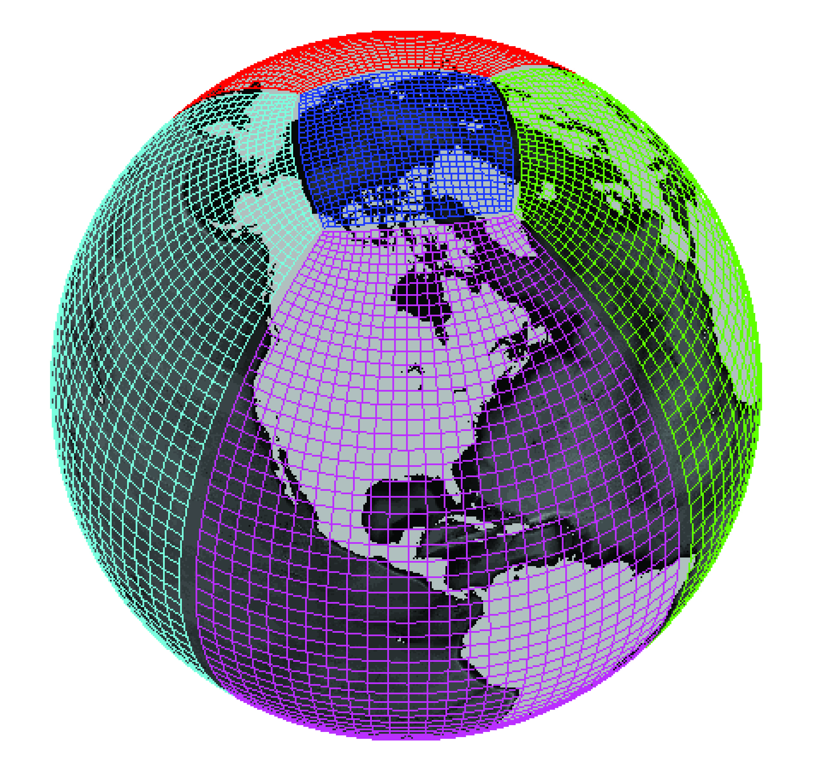
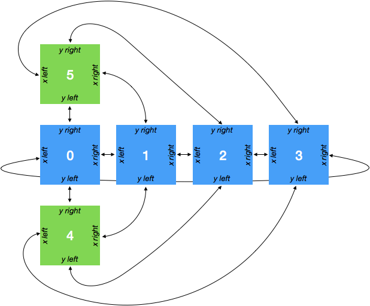

.. _grid_topology:

Grid Topology
-------------

.. warning::

    The features described in this page should be considered experimental. The
    API is subject to change. Please report any unexpected behavior or
    unpleasant experiences on the
    `github issues page <https://github.com/xgcm/xgcm/issues>`_

Faces and Connections
~~~~~~~~~~~~~~~~~~~~~

Simple grids, as described on the :ref:`grids` page, consist of a
single logically rectangular domain.
Many modern GCMs use more complex grid topologies, consisting of multiple
logically rectangular grids connected at their edges.
xgcm is capable of understanding the connections between these grid
*faces* and exchanging data between them appropriately.

  Example of a lat-lon-cap grid from the MIT General Circulation Model.
  Image credit `Gael Forget <http://www.gaelforget.net/>`_.
  More information about the simulation and grid available at
  https://doi.org/10.5194/gmd-8-3071-2015.

In order to construct such a complex grid topology, we need a way to tell
xgcm about the connections between faces. This is accomplished via the
``face_connections`` keyword argument to the ``Grid`` constructor.
Below we illustrate how this works with a series of increasingly complex
examples.
If you just want to get the detailed specifications for ``face_connections``,
jump down to :ref:`face_connections_spec`.

Examples
~~~~~~~~

Two Connected Faces
^^^^^^^^^^^^^^^^^^^

The simplest possible scenario is two faces connected at one side. Consider
the following dataset

.. ipython:: python

    import numpy as np
    import xarray as xr

    N = 25
    ds = xr.Dataset(
        {"data_c": (["face", "y", "x"], np.random.rand(2, N, N))},
        coords={
            "x": (("x",), np.arange(N), {"axis": "X"}),
            "xl": (
                ("xl"),
                np.arange(N) - 0.5,
                {"axis": "X", "c_grid_axis_shift": -0.5},
            ),
            "y": (("y",), np.arange(N), {"axis": "Y"}),
            "yl": (
                ("yl"),
                np.arange(N) - 0.5,
                {"axis": "Y", "c_grid_axis_shift": -0.5},
            ),
            "face": (("face",), [0, 1]),
        },
    )
    ds

The dataset has two spatial axes (``X`` and ``Y``), plus an additional dimension
``face`` of length 2.
Let's imagine the two faces are joined in the following way:

.. figure:: images/two_faces.png
  :alt: two connected faces

We can construct a grid that understands this connection in the following way

.. ipython:: python

    import xgcm

    face_connections = {
        "face": {0: {"X": (None, (1, "X", False))}, 1: {"X": ((0, "X", False), None)}}
    }
    grid = xgcm.Grid(ds, face_connections=face_connections)
    grid

The ``face_connections`` dictionary tells xgcm that ``face`` is the name of the
dimension that contains the different faces. (It might have been called
``tile`` or ``facet`` or something else similar.) This dictionary say that
face number 0 is connected along the X axis to nothing on the left and to face
number 1 on the right. A complementary connection exists from face number 1.
These connections are checked for consistency.

We can now use :py:meth:`grid.interp() <xgcm.Grid.interp>` and
:py:meth:`grid.diff() <xgcm.Grid.diff>` to correctly interpolate and difference
across the connected faces.

Two Faces with Rotated Axes
^^^^^^^^^^^^^^^^^^^^^^^^^^^

.. ipython:: python

    face_connections = {
        "face": {0: {"X": (None, (1, "Y", False))}, 1: {"Y": ((0, "X", False), None)}}
    }
    grid = xgcm.Grid(ds, face_connections=face_connections)
    grid

Cubed Sphere
^^^^^^^^^^^^

A more realistic and complicated example is a cubed sphere. One possible
topology for a cubed sphere grid is shown in the figure below:

This geomtry has six faces. We can generate an xarray Dataset that has two
spatial dimensions and a face dimension as follows:

.. ipython:: python

    ds = xr.Dataset(
        {"data_c": (["face", "y", "x"], np.random.rand(6, N, N))},
        coords={
            "x": (("x",), np.arange(N), {"axis": "X"}),
            "xl": (
                ("xl"),
                np.arange(N) - 0.5,
                {"axis": "X", "c_grid_axis_shift": -0.5},
            ),
            "y": (("y",), np.arange(N), {"axis": "Y"}),
            "yl": (
                ("yl"),
                np.arange(N) - 0.5,
                {"axis": "Y", "c_grid_axis_shift": -0.5},
            ),
            "face": (("face",), np.arange(6)),
        },
    )
    ds

We specify the face connections and create the ``Grid`` object as follows:

.. ipython:: python

    face_connections = {
        "face": {
            0: {
                "X": ((3, "X", False), (1, "X", False)),
                "Y": ((4, "Y", False), (5, "Y", False)),
            },
            1: {
                "X": ((0, "X", False), (2, "X", False)),
                "Y": ((4, "X", False), (5, "X", True)),
            },
            2: {
                "X": ((1, "X", False), (3, "X", False)),
                "Y": ((4, "Y", True), (5, "Y", True)),
            },
            3: {
                "X": ((2, "X", False), (0, "X", False)),
                "Y": ((4, "X", True), (5, "X", False)),
            },
            4: {
                "X": ((3, "Y", True), (1, "Y", False)),
                "Y": ((2, "Y", True), (0, "Y", False)),
            },
            5: {
                "X": ((3, "Y", False), (1, "Y", True)),
                "Y": ((0, "Y", False), (2, "Y", True)),
            },
        }
    }
    grid = xgcm.Grid(ds, face_connections=face_connections)
    grid

For a real-world example of how to use face connections, check out the
`MITgcm ECCOv4 example`_.

.. _MITgcm ECCOv4 example: example_eccov4.ipynb

.. _face_connections_spec:

Face Connections Spec
~~~~~~~~~~~~~~~~~~~~~

Because of the diversity of different model grid topologies, xgcm tries to
avoid making assumptions about the nature of the connectivity between faces.
It is up to the user to specify this connectivity via the
``face_connections`` dictionary.
The ``face_connections`` dictionary has the following general stucture

.. code-block:: none

    {'<FACE DIMENSION NAME>':
        {<FACE DIMENSION VALUE>:
             {'<AXIS NAME>': (<LEFT CONNECTION>, <RIGHT CONNECTION>),
              ...}
        ...
    }

``<LEFT CONNECTION>>`` and ``<RIGHT CONNECTION>`` are either ``None`` (for no
connection) or a three element tuple with the following contents

.. code-block:: none

    (<FACE DIMENSION VALUE>, `<AXIS NAME>`, <REVERSE CONNECTION>)

``<FACE DIMENSION VALUE>`` tells which face this face is connected to.
``<AXIS NAME>`` tells which axis on that face is connected to this one.
``<REVERSE CONNECTION>`` is a boolean specifying whether the connection is
"reversed". A normal (non reversed) connection connects the right edge of one
face to the left edge of another face. A reversed connection connects
left to left, or right to right.

.. note::

  We may consider adding standard ``face_connections`` dictionaries for common
  models (e.g. MITgcm, GEOS, etc.) as a convenience within xgcm. If you would
  like to pursue this, please open a
  `github issue <https://github.com/xgcm/xgcm/issues>`_.
