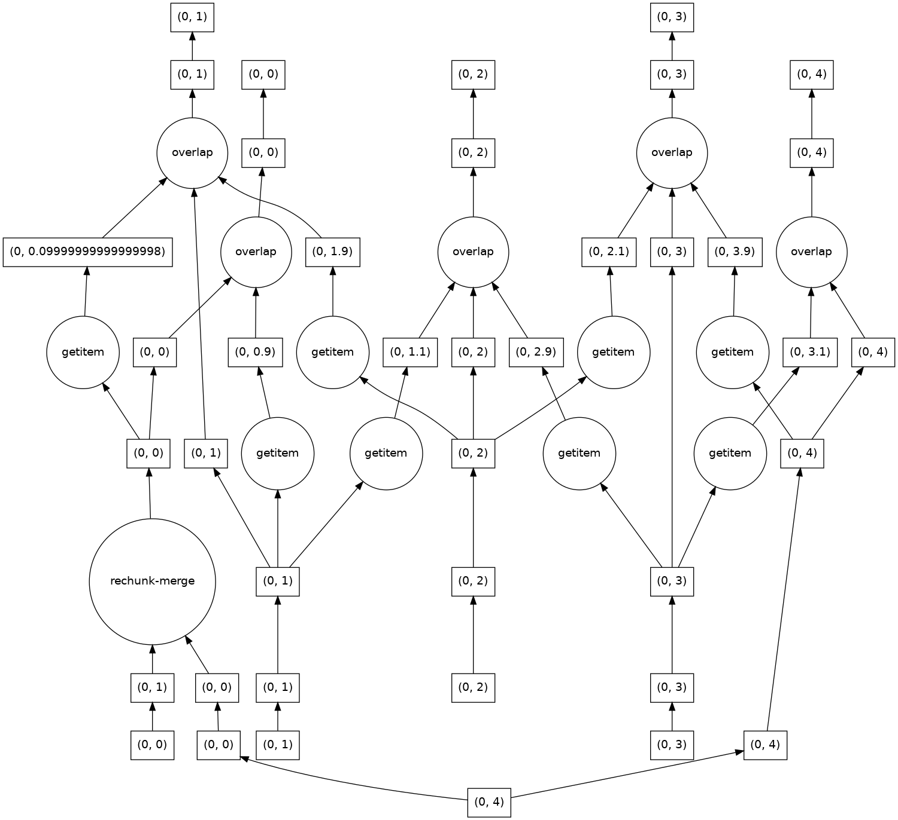

.. _grid_ufuncs:

Grid Ufuncs
-----------

Concept of a Grid Ufunc
~~~~~~~~~~~~~~~~~~~~~~~

In short, a "grid ufunc" is a generalisation of a numpy generalized universal function to include the xGCM Axes and Positions of input and output variables.

If you are not already familiar with the concept `numpy generalized universal function`_ (hereon referred to a "numpy ufunc"),
then have a read of the linked documentation.
You will also need to understand the `concept of "core dims"`_ used in ``xarray.apply_ufunc``.

We tell a grid ufunc about the xGCM axes information through a ``signature``.
For example, imagine we have a function which accepts data located at the center grid positions and returns
data located at the left-hand grid positions, on the same axis.
The signature for this function would look like:

``"(ax1:center)->(ax1:left)"``.

Grid ufuncs allow us to:

- Avoid mistakes by stating that functions are only valid for data on specific grid positions,
- Neatly promote numpy functions to grid-aware xarray functions,
- Conveniently apply :ref:`Boundary Conditions` and :ref:`Grid Topology`,
- Boost performance relative to chaining many ``Grid.diff`` or ``Grid.interp`` operations,
- Immediately parallelize our operations with dask (see :ref:`Parallelizing with Dask`).

.. _numpy generalized universal function: https://numpy.org/doc/stable/reference/c-api/generalized-ufuncs.html
.. _concept of "core dims": https://xarray.pydata.org/en/stable/generated/xarray.apply_ufunc.html

The ``signature``
~~~~~~~~~~~~~~~~~

The "signature" of a grid ufunc is how we tell it which input and output variables should be on which axis positions.
A simple example would be
``"(ax1:center)->(ax1:left)"``

The signature has two parts, one for the input variables, and one for the output variables.
The output variables live on the right of the arrow (``->``).

There needs to be one entry in parentheses for each variable,
so in this case the signature tells use that the function accepts one input data variable and returns one output data variable.
(Functions which accept a data variable in the form of a keyword-only argument are not supported.)

For each variable, the signature tells us the ``xgcm.Axis`` positions we require that variable to have,
both before and after our grid ufunc is applied.
This information is encoded in the format ``axis_name:position``.
Each variable can be operated on along multiple axes, which are separated by a comma, e.g. ``(ax1:left, ax2:right)``.

The axis names used in the signature are dummy names: they do not have to be the same as the axis names used in your ``Grid`` object.
This allows you to write a grid ufunc that can accept axes with any name.
Therefore the signature ``"(ax1:center)->(ax1:left)"`` means all of:

`"This function accepts one data variable and applies an operation over one core dimension.
The input data lies on the center grid positions of the singular axis along which we will choose to apply the function.
After performing its numerical operation the single return value from this function will have been shifted onto the left-hand grid positions of the same axis."`

To give you an idea of how we might use grid ufuncs here is a table of possible grid ufuncs and their corresponding signatures:

.. list-table:: Example signatures for different grid ufuncs
   :widths: 25 25 50
   :header-rows: 1

   * - Name
     - Signature
     - Description
   * - ``diff_center_to_left(a)``
     - ``"(X:center)->(X:left)"``
     - Backward difference
   * - ``interp_center_to_left(a)``
     - ``"(X:center)->(X:left)"``
     - Backward interpolation
   * - ``diff_left_to_center(a)``
     - ``"(X:left)->(X:center)"``
     - Forward difference
   * - ``interp_left_to_center(a)``
     - ``"(X:left)->(X:center)"``
     - Forward interpolation
   * - ``diff_center_to_center(a)``
     - ``"(X:center)->(X:center)"``
     - Second order central difference
   * - ``mean_depth(w)``
     - ``"(depth:center)->()"``
     - Reduction
   * - ``inner_product_left_right(a, b)``
     - ``"(X:left),(X:right)->()"``
     - Reduction of two variables
   * - ``u_grid_vorticity(u, v)``
     - ``"(lon:left,lat:center),``
       ``(lon:center,lat:left)``
       ``->(lon:left,lat:left)"``
     - Complex example calculating vorticity on an Arakawa U-grid in 2D

.. note::

    Remember the axis names in the signature are dummy names - in the example above you could apply ``mean_depth`` along
    an axis not called ``"depth"`` if you wish.

    The ``axis`` argument is the one which must correspond to an ``xgcm.Axis`` of the grid.
    Therefore applying a grid ufunc with signature ``"(X:center)->()"`` or ``"(depth:center)->()"`` along ``axis='X'`` will
    yield identical results in both cases.


Defining New Grid Ufuncs
~~~~~~~~~~~~~~~~~~~~~~~~

Let's imagine we have a numpy function which does forward differencing along one dimension, with an implicit periodic boundary condition.

.. ipython:: python

    import numpy as np

.. ipython:: python

    def diff_forward(a):
        return a - np.roll(a, -1, axis=-1)

All this function does is subtract each element of the given array from the element immediately to its right,
with the ends of the array wrapped around in a periodic fashion.
If we imagine this function acting on a variable located at the cell centers,
our :ref:`axis-positions` diagram suggests that the result would lie on the left-hand cell edges.
Therefore the signature of this function could be
``"(ax1:center)->(ax1:left)"``.

.. note::

    XGCM assumes the function acts along the last axis of the numpy array, which is why we have specified ``axis=-1`` here.

There are multiple options for how to apply this numpy ufunc as a grid ufunc.

We're going to need a grid object, and some data, so we use the same demonstration grid and dataarray that we defined when we introduced :ref:`grids`.
Our grid object has one Axis (``"X"``), which has two coordinates, on positions ``"center"`` and ``"left"``.

.. ipython:: python

    import xarray as xr

    from xgcm import Grid

    ds = xr.Dataset(
        coords={
            "x_c": (
                ["x_c"],
                np.arange(1, 10),
            ),
            "x_g": (
                ["x_g"],
                np.arange(0.5, 9),
            ),
        }
    )

    grid = Grid(ds, coords={"X": {"center": "x_c", "left": "x_g"}})
    grid

Our data starts on the cell centers.

.. ipython:: python

    da = np.sin(ds.x_c * 2 * np.pi / 9)
    da


Applying directly
^^^^^^^^^^^^^^^^^

The quickest option is to apply our function directly, using ``apply_as_grid_ufunc``

.. ipython:: python

    from xgcm import apply_as_grid_ufunc

    result = apply_as_grid_ufunc(
        diff_forward, da, axis=[["X"]], signature="(ax1:center)->(ax1:left)", grid=grid
    )

    result

Here we have applied the grid ufunc to the data, along the axis ``"X"`` of the grid.
(The nested-list format of `axis` is to match the fact we supplied one input data variable, which only has one axis.)
The dummy axis name ``ax1`` gets substituted by ``"X"`` during the call, so this will fail if our data does not depend on the axis we attempt to apply the ufunc along.

We can see that the result has been shifted onto the output grid positions along ``"X"``, so now lies on the left-hand cell edges.

Decorator with signature
^^^^^^^^^^^^^^^^^^^^^^^^

Alternatively you can permanently turn a numpy function into a grid ufunc by using the ``@as_grid_ufunc`` decorator.

.. ipython:: python

    from xgcm import as_grid_ufunc

.. ipython:: python

    @as_grid_ufunc(signature="(ax1:center)->(ax1:left)")
    def diff_center_to_left(a):
        return diff_forward(a)

Now when we call the ``diff_center_to_left`` function, it will act as if we had applied it using ``apply_as_grid_ufunc``.

.. ipython:: python

    diff_center_to_left(grid, da, axis=[["X"]])

Notice that we still need to provide the ``grid`` and ``axis`` arguments when we call the decorated function.

Decorator with type hints
^^^^^^^^^^^^^^^^^^^^^^^^^

Finally you can use type hints to specify the grid positions of the variables instead of passing a ``signature`` argument.

.. ipython:: python

    from typing import Annotated

.. ipython:: python

    @as_grid_ufunc()
    def diff_center_to_left(
        a: Annotated[np.ndarray, "ax1:center"]
    ) -> Annotated[np.ndarray, "ax1:left"]:
        return diff_forward(a)

Again we call this decorated function, remembering to supply the grid and axis arguments

.. ipython:: python

    diff_center_to_left(grid, da, axis=[["X"]])

The signature argument is incompatible with using ``Annotated`` to annotate the types of any of the function arguments
- i.e. you cannot mix the signature approach with the type hinting approach.

.. note::

    If you want to use type hints to specify a signature with multiple return arguments, your return value should be type hinted as a tuple of annotated hints, e.g.
    ``Tuple[Annotated[np.ndarray, "ax1:left"], Annotated[np.ndarray, "ax1:right"]]``.

Boundaries and Padding
~~~~~~~~~~~~~~~~~~~~~~

Manually Applying Boundary Conditions
^^^^^^^^^^^^^^^^^^^^^^^^^^^^^^^^^^^^^

The example differencing function we used above had an implicit periodic boundary condition,
but what if we wanted to use a different boundary condition?

We'll show this using a simple linear interpolation function.
It has the same signature at the differencing function we used above, but it does not apply any specific boundary condition.

.. ipython:: python

    def interp(a):
        return 0.5 * (a[..., :-1] + a[..., 1:])

This function simply averages each element from the one on its right, but that means the resulting array is shorter by one element.

.. ipython:: python

    arr = np.arange(9)
    arr
    arr.shape

    interpolated = interp(arr)
    interpolated
    interpolated.shape

Applying a boundary condition during this operation is equivalent to choosing how to pad the original array
so that the application of ``interp`` still returns an array of the starting length.

We could do this manually - implementing a periodic boundary condition would mean first pre-pending the right-most element of the input array onto the left-hand side:

.. ipython:: python

    periodically_padded_arr = np.insert(arr, 0, arr[-1])
    periodically_padded_arr

    interpolated_periodically = interp(periodically_padded_arr)
    interpolated_periodically.shape

and implementing a constant zero-padding boundary condition would mean first pre-pending the input array with a zero:

.. ipython:: python

    zero_padded_arr = np.insert(arr, 0, 0)
    zero_padded_arr

    interpolated_with_zero_padding = interp(zero_padded_arr)
    interpolated_with_zero_padding
    interpolated_with_zero_padding.shape

In both cases the result has the same length as the original input array.
We can also see that the result depends on the choice of boundary conditions.

Automatically Applying Boundary Conditions
^^^^^^^^^^^^^^^^^^^^^^^^^^^^^^^^^^^^^^^^^

Doing this manually is a chore, so xgcm allows you to apply boundary conditions automatically when using grid ufuncs.

When doing the padding manually for ``interp``, we had to add one element on the left-hand side of the ```"X"`` axis,
so we tell xGCM to do the same thing by specifying the keyword argument ``boundary_width={"X": (1, 0)}``,

.. ipython:: python

    @as_grid_ufunc(signature="(X:center)->(X:left)", boundary_width={"X": (1, 0)})
    def interp_center_to_left(a):
        return interp(a)

Now when we run our decorated function `interp_center_to_left`, xgcm will automatically add an extra element to the left hand side for us,
before applying the operation in the function we decorated.

.. ipython:: python

    # Create new test data with same coordinates but linearly-spaced data
    da = da.copy(data=arr)

    interp_center_to_left(grid, da, axis=[["X"]])

Here a periodic boundary condition has been used as the default, but we can choose other boundary conditions using the ``boundary`` kwarg:

.. ipython:: python

    @as_grid_ufunc(
        signature="(X:center)->(X:left)",
        boundary_width={"X": (1, 0)},
        boundary="fill",
        fill_value=0,
    )
    def interp_center_to_left_fill_with_zeros(a):
        return interp(a)

.. ipython:: python

    interp_center_to_left_fill_with_zeros(
        grid, da, axis=[["X"]], boundary="fill", fill_value=0
    )

We can also choose a different default boundary condition at decorator definition time,
and then override it at function call time if we prefer.

.. ipython:: python

    interp_center_to_left(grid, da, axis=[["X"]], boundary="fill", fill_value=0)

For more advanced examples of grid ufuncs, see the page on :ref:`ufunc examples`.

Metrics
~~~~~~~

.. note::

    Automatically supplying metrics directly to grid ufuncs is not yet implemented, but will be soon!
    For now, if you need a metric in your grid ufunc, simply include it as an input and pass it explicitly.
    To work with metrics outside of grid ufuncs see the documentation page on metrics.


.. _Parallelizing with Dask:

Parallelizing with Dask
~~~~~~~~~~~~~~~~~~~~~~~

The grid ufunc apparatus is designed so that if your data is chunked, it will apply your ufunc operation in a dask-efficient manner.
There are two cases of interest to understand: parallelizing an operation over data chunked along a "broadcast" dimension, and
over data chunked along a "core" dimension.

If you don't know what that means then read about the `concept of "core dims"`_ used in ``xarray.apply_ufunc``.

.. _concept of "core dims": https://xarray.pydata.org/en/stable/generated/xarray.apply_ufunc.html


Parallelizing Along Broadcast Dimensions
^^^^^^^^^^^^^^^^^^^^^^^^^^^^^^^^^^^^^^^^

This case is for when your data is chunked along the dim corresponding to the axis along which you want to apply the grid ufunc.
The numpy ufunc you are wrapping must be able to act on each element along that axis independently.

This case is parallelized under the hood by calling ``xarray.apply_ufunc``.
In order to enable working with chunked arrays you must pass the kwarg ``dask='parallelized'`` to ``apply_as_grid_ufunc``.

.. ipython:: python

    # Let's create some 2D data, so we have a dimension over which to broadcast
    da_2d = da.expand_dims(y=4)

    # Let's also chunk it along the new "broadcast" dimension
    chunked_y = da_2d.chunk({"y": 1})
    chunked_y

    result = interp_center_to_left(grid, chunked_y, axis=[["X"]], dask="parallelized")


(We could also have passed the ``dask`` kwarg to the ``@as_grid_ufunc`` decorator, and it would have been bound
to the new function in the same way that the boundary kwargs work.)

The dask graph in this case is simple, because this is an "embarrasingly parallel" problem.

.. code-block:: python

    result.data.visualize(optimize_graph=True)

.. image:: images/parallelize_broadcast.png
   :height: 400px
   :alt: Dask task graph for parallelizing along a broadcast dimension

The result is as expected from padding each row independently.

.. ipython:: python

    result.compute()

Parallelizing Along Core Dimensions
^^^^^^^^^^^^^^^^^^^^^^^^^^^^^^^^^^^

The other case is for when your data is chunked along the axis over which you want to apply your ufunc (a "core" dimension").

.. ipython:: python

    chunked_x = da_2d.chunk({"x_c": 2})
    chunked_x

XGCM can also parallelize this case, by calling ``dask.map_overlap``.
You tell it to invoke ``dask.map_overlap`` by passing ``dask="parallelized"`` and ``map_overlap=True``.

.. ipython:: python

    result = interp_center_to_left(
        grid, chunked_x, axis=[["X"]], dask="allowed", map_overlap=True
    )

If your ufunc operates on individual chunks independently, then ``dask.map_blocks`` would have been sufficient,
but the possibility of padding boundaries means that ``dask.map_overlap`` is required.
The dask graph is more complicated, because each chunk along the core dim needs to communicate its ``boundary_width`` elements to adjacent chunks.

.. code-block:: python

    result.data.visualize(optimize_graph=True)



.. ipython:: python

    result.compute()

There is one limitation of this feature: you cannot use ``map_overlap`` with grid ufuncs that change length along a core dimension
(e.g. by shifting axis positions from ``center`` to ``outer``).
XGCM will raise an error if you try to do this.
