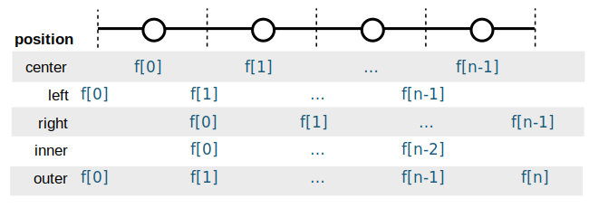

.. _grids:

Simple Grids
------------

General Concepts
~~~~~~~~~~~~~~~~

Most finite volume ocean models use `Arakawa Grids`_, in which different
variables are offset from one another and situated at different locations with
respect to the cell center and edge points.
As an example, we will consider *C-grid geometry*.
As illustrated in the figure below, C-grids place scalars (such as
temperature) at the cell center and vector components (such as velocity) at
the cell faces. This type of grid is widely used because of its favorable
conservation properties.

.. figure:: images/grid2d_hv.svg
  :scale: 100
  :alt: C-grid Geometry

  Layout of variables with respect to cell centers and edges in a C-grid
  ocean model. Image from the
  `pycomodo project <https://web.archive.org/web/20160417032300/http://pycomodo.forge.imag.fr/norm.html>`_.

These grids present a dilemma for the `xarray`_ data model. The ``u`` and ``t``
points in the example above are located at different points along the x-axis,
meaning they can't be represented using a single coordinate. But they are
clearly related and can be transformed via well defined interpolation and
difference operators. One goal of xgcm is to provide these interpolation
and difference operators.

We use `MITgcm notation`_ to denote the basic operators that transform between
grid points. The difference operator is defined as

.. math::

   \delta_i \Phi = \Phi_{i+1/2} - \Phi_{i-1/2}

where :math:`\Phi` is any variable and ``i`` represents the grid index.
The other basic operator is interpolation,
defined as

.. math::

   \overline{\Phi} = (\Phi_{i+1/2} + \Phi_{i-1/2})/2

Both operators return a variable that is shifted by half a gridpoint
with respect to the input variable.
With these two operators, the entire suite of finite volume vector calculus
operations can be represented.

An important consideration for both interpolation and difference operators is
boundary conditions.
xgcm currently supports periodic,
`Dirichlet <https://en.wikipedia.org/wiki/Dirichlet_boundary_condition>`_, and
`Neumann <https://en.wikipedia.org/wiki/Neumann_boundary_condition>`_ boundary
conditions, although the latter two are limited to simple cases, see :ref:`Boundary conditions`.

The inverse of differentiation is integration. For finite volume grids, the
inverse of the difference operator is a discrete cumulative sum. xgcm also
provides a grid-aware version of the ``cumsum`` operator.

Axes and Positions
~~~~~~~~~~~~~~~~~~

A fundamental concept in xgcm is the notion of an "axis". An axis is a group
of coordinates that all lie along the same *physical dimension* but describe
different positions relative to a grid cell. There are currently five
possible positions supported by xgcm.

    ``center``
        The variable values are located at the cell center.

    ``left``
        The variable values are located at the left (i.e. lower) face of the
        cell.

    ``right``
        The variable values are located at the right (i.e. upper) face of the
        cell.

    ``inner``
        The variable values are located on the cell faces, excluding both
        outer boundaries.

    ``outer``
        The variable values are located on the cell faces, including both
        outer boundaries.

The first three (``center``, ``left``, and ``right``) all have the same length
along the axis dimension, while ``inner`` has one fewer point and ``outer`` has
one extra point. These positions are visualized in the figure below.

   The different possible positions of a variable ``f`` along an axis.

xgcm represents an axis using the :class:`xgcm.Axis` class.

Although it is possible to create an ``Axis`` directly, the recommended way to
to use xgcm is by creating a single ``Grid`` object, containing multiple axes
for each physical dimension.

Creating ``Grid`` Objects
~~~~~~~~~~~~~~~~~~~~~~~~~

The core object in xgcm is an :class:`xgcm.Grid`. A ``Grid`` object should be
constructed once and then used whenever grid-aware operations are required
during the course of a data analysis routine.
Xgcm operates on :py:class:`xarray.Dataset` and :py:class:`xarray.DataArray`
objects. A basic understanding of
:ref:`xarray data structures <xarray:data structures>` is therefore needed to
understand xgcm.

When constructing an :class:`xgcm.Grid` object, we need to pass an
:py:class:`xarray.Dataset` object containing all of the necessary coordinates
for the different axes we wish to use.
We also have to tell xgcm how those
coordinates are related to each other, i.e. which positions they occupy along
the axis. We can provide this information in two ways: manually or via dataset
attributes.

.. note::

  In most real use cases, the input dataset to create a ``Grid`` will be a
  come from a netCDF file generated by a GCM simulation.
  In this documentation, we create datasets from scratch in order to make the
  examples self-contained and portable.

Manually Specifying Axes
^^^^^^^^^^^^^^^^^^^^^^^^

To begin, let's create a simple example :py:class:`xarray.Dataset` with
a single physical axis. This dataset will contain two coordinates:

  - ``x_c``, which represents the cell center
  - ``x_g``, which represents the left cell edge

We create it as follows.

.. ipython:: python

    import xarray as xr
    import numpy as np

    ds = xr.Dataset(
        coords={
            "x_c": (
                [
                    "x_c",
                ],
                np.arange(1, 10),
            ),
            "x_g": (
                [
                    "x_g",
                ],
                np.arange(0.5, 9),
            ),
        }
    )
    ds

.. note::

  The choice of these coordinate names (``x_c`` and ``x_g``) is totally
  arbitrary.
  xgcm never requires datasets to have specific variable names. Rather,
  the axis geometry is specified by the user or inferred through the
  attributes.

At this point, xarray has no idea that ``x_c`` and ``x_g`` are related to
each other; they are subject to standard
:ref:`xarray broadcasting rules <xarray:compute.broadcasting>`.
When we create an :class:`xgcm.Grid`, we need to specify that they are part
of the same axis. We do this using the ``coords`` keyword argument, as follows:

.. ipython:: python

    from xgcm import Grid

    grid = Grid(ds, coords={"X": {"center": "x_c", "left": "x_g"}})
    grid

The printed information about the grid indicates that xgcm has successfully
undestood the relative location of the different coordinates along the x axis.
Because we did not
specify the ``periodic`` keyword argument, xgcm assumed that the data
is periodic along all axes.
The arrows after each coordinate indicate the default shift positions for
interpolation and difference operations: operating on the center coordinate
(``x_c``) shifts to the left coordinate (``x_g``), and vice versa.

Detecting Axes from Dataset Attributes
^^^^^^^^^^^^^^^^^^^^^^^^^^^^^^^^^^^^^^

It is possible to avoid manually specifying the axis information via the
``coords`` keyword if the dataset contains specific metadata that can
tell xgcm about the relationship between different coordinates.
If ``coords`` is not specified, xgcm looks for this metadata in the coordinate
attributes.
Wherever possible, we try to follow established metadata conventions, rather
than defining new metadata conventions. The two main relevant conventions
are the `CF Conventions`_, which apply broadly to Climate and Forecast datasets
that follow the netCDF data model, and the `COMODO conventions`_, which define
specific attributes relevant to Arakawa grids. While the COMODO conventions
were designed with C-grids in mind, we find they are general enough to support
all the different Arakawa grids.

The key attribute xgcm looks for is ``axis``.
When creating a new grid, xgcm will search through the dataset dimensions
looking for dimensions with the ``axis`` attribute defined.
All coordinates with the same value of ``axis`` are presumed to belong to the
same physical axis.
To determine the positions of the different coordinates, xgcm considers both
the length of the coordinate variable and the ``c_grid_axis_shift`` attribute,
which determines the position of the coordinate with respect to the cell center.
The only acceptable values of ``c_grid_axis_shift`` are ``-0.5`` and ``0.5``.
If the ``c_grid_axis_shift`` attribute attribute is absent, the coordinate is
assumed to describe a cell center.
The cell center coordinate is identified first; the length of other coordinates
relative to the cell center coordinate is used in conjunction with
``c_grid_axis_shift`` to infer the coordinate positions, as summarized by the
table below.

+--------+--------------------------+----------+
| length | ``c_grid_axis_shift``    | position |
+========+==========================+==========+
| n      | *None*                   | center   |
+--------+--------------------------+----------+
| n      | -0.5                     | left     |
+--------+--------------------------+----------+
| n      | 0.5                      | right    |
+--------+--------------------------+----------+
| n-1    | 0.5 or -0.5              | inner    |
+--------+--------------------------+----------+
| n+1    | 0.5 or -0.5              | outer    |
+--------+--------------------------+----------+

We create an :py:class:`xarray.Dataset` with such attributes as follows:

.. ipython:: python

    ds = xr.Dataset(
        coords={
            "x_c": (
                [
                    "x_c",
                ],
                np.arange(1, 10),
                {"axis": "X"},
            ),
            "x_g": (
                [
                    "x_g",
                ],
                np.arange(0.5, 9),
                {"axis": "X", "c_grid_axis_shift": -0.5},
            ),
        }
    )
    ds

(This is the same as the first example, just with additional attributes.)
We can now create a ``Grid`` object from this dataset without manually
specifying ``coords``:

.. ipython:: python

    grid = Grid(ds)
    grid

We see that the resulting ``Grid`` object is the same as in the manual example.

Core Grid Operations: ``diff``, ``interp``, and ``cumsum``
~~~~~~~~~~~~~~~~~~~~~~~~~~~~~~~~~~~~~~~~~~~~~~~~~~~~~~~~~~

Regardless of how our ``Grid`` object was created, we can now use it to
interpolate or take differences along the axis. First we create some test data:

.. ipython:: python

    import matplotlib.pyplot as plt

    f = np.sin(ds.x_c * 2 * np.pi / 9).rename("f")
    print(f)
    @savefig grid_test_data.png
    f.plot()
    plt.close()

We interpolate as follows:

.. ipython:: python

    f_interp = grid.interp(f, axis="X")
    f_interp

We see that the output is on the ``x_g`` points rather than the original ``x_c``
points.

.. warning::

    xgcm does not perform input validation to verify that ``f`` is
    compatible with ``grid``.

The same position shift happens with a difference operation:

.. ipython:: python

    f_diff = grid.diff(f, axis="X")
    f_diff

We can reverse the difference operation by taking a cumsum:

.. ipython:: python

    grid.cumsum(f_diff, "X")

Which is approximately equal to the original ``f``, modulo the numerical errors
accrued due to the discretization of the data.

By default, these grid operations will drop any coordinate that are not
dimensions. The keep_coords argument allow to preserve compatible coordinates.
For example:

.. ipython:: python

    f2 = f + xr.Dataset(coords={"y": np.arange(1, 3)})["y"]
    f2 = f2.assign_coords(h=f2.y**2)
    print(f2)
    grid.interp(f2, "X", keep_coords=True)

So far we have just discussed simple grids (i.e. regular grids with a single
face).
Xgcm can also deal with complex topologies such as cubed-sphere and
lat-lon-cap.
This is described in the :ref:`grid_topology` page.

.. _Boundary conditions:

Boundary conditions
~~~~~~~~~~~~~~~~~~~

For variables located at the boundaries, some operations need boundary conditions.
Let's use the previous example axis, with center and left points::

    |     |     |     |     |
    U--T--U--T--U--T--U--T--|
    |     |     |     |     |

If we have a variable at the U (left) points, we have a problem for some operation
(e.g. differentiating): how to treat the last T point?
The solution is to add an extra point for the computation ('X' point on the following sketch)::

    |     |     |     |     |
    U--T--U--T--U--T--U--T--X
    |     |     |     |     |

Different options are possible (``fill`` this extra value with a certain number,
``extend`` to the nearest value, ``extrapolate`` linearly using the 2 nearest points,
or periodic condition if the grid axis is periodic).
Attention, this boundary condition is used to give the value of X, not to give the value of the
boundary T point after the operation.

We can illustrate it by creating some data located at the U point:

.. ipython:: python

    g = np.sqrt(ds.x_g + 0.5) + np.sin((ds.x_g - 0.5) * 2 * np.pi / 8)
    g

We show here the value of the extra added point for 5 cases (extended, extrapolated, filled with 0, filled with 5,
and periodic). The periodic condition is not an argument of the methods, but is provided
as an argument of the ``xgcm.Grid``. We will thus also create 2 grids: one periodic and another one not periodic.

.. ipython::

    In [1]: def plot_bc(ds):
       ...:     plt.plot(ds.x_g, g, marker="o", color="C6", label="g")
       ...:     #
       ...:     plt.scatter(
       ...:         [ds.x_g[-1] + 1],
       ...:         [2 * g[-1] - g[-2]],
       ...:         color="C0",
       ...:         label="extrapolate",
       ...:         marker="o",
       ...:     )
       ...:     plt.plot(
       ...:         [ds.x_g[-2], ds.x_g[-1] + 1],
       ...:         [g[-2], 2 * g[-1] - g[-2]],
       ...:         "--",
       ...:         color="C0",
       ...:         label="_",
       ...:     )
       ...:     #
       ...:     plt.scatter([ds.x_g[-1] + 1], [g[-1]], color="C1", label="extend", marker="v")
       ...:     plt.plot(
       ...:         [ds.x_g[-1], ds.x_g[-1] + 1], [g[-1], g[-1]], "--", color="C1", label="_"
       ...:     )
       ...:     #
       ...:     plt.scatter([ds.x_g[-1] + 1], [0], color="C2", label="fill0", marker="s")
       ...:     plt.scatter([ds.x_g[-1] + 1], [5], color="C3", label="fill5", marker="P")
       ...:     #
       ...:     plt.scatter([ds.x_g[-1] + 1], g[0], color="C4", label="periodic", marker="X")
       ...:     plt.plot([ds.x_g[0], ds.x_g[-1] + 1], [g[0], g[0]], "--", color="C4", label="_")
       ...:     #
       ...:     plt.xlabel("x_g")
       ...:     plt.legend()
       ...:     return

    @suppress
    In [2]: plt.grid(True)

    @savefig grid_bc_extra_point.png
    In [3]: plot_bc(ds)

    @suppress
    In [4]: plt.close()

If we now compute the difference using the 5 conditions:

.. ipython:: python

    grid_no_perio = Grid(ds, periodic=False)
    grid_perio = Grid(ds, periodic=True)

    g_extend = grid_no_perio.diff(g, "X", boundary="extend").rename("extend")
    g_extrapolate = grid_no_perio.diff(g, "X", boundary="extrapolate").rename(
        "extrapolate"
    )
    g_fill_0 = grid_no_perio.diff(g, "X", boundary="fill", fill_value=0).rename("fill0")
    g_fill_2 = grid_no_perio.diff(g, "X", boundary="fill", fill_value=5).rename("fill5")
    g_perio = grid_perio.diff(g, "X").rename("periodic")

.. ipython::

    In [1]: for (i, var) in enumerate([g_extrapolate, g_extend, g_fill_0, g_fill_2, g_perio]):
       ...:     var.plot.line(marker="o", label=var.name)

    @suppress
    In [2]: plt.grid(True)

    @savefig grid_bc_diff.png
    In [3]: plt.legend()

As expected the difference at x_c=9 is 0 for the case ``extend``,
equals the difference at the point x_c=8 for the case ``extrapolate``,
is ``-2 = 1 - 3`` for the periodic case,
is ``-3 = 0 - 3`` for the ``fill`` with 0 case,
and is ``2 = 5 - 3`` for the ``fill`` with 5 case.

.. _Arakawa Grids: https://en.wikipedia.org/wiki/Arakawa_grids
.. _xarray: http://xarray.pydata.org
.. _MITgcm notation: http://mitgcm.org/public/r2_manual/latest/online_documents/node31.html
.. _CF Conventions: http://cfconventions.org/
.. _COMODO Conventions: https://web.archive.org/web/20160417032300/http://pycomodo.forge.imag.fr/norm.html
