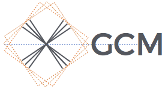

|

xgcm: General Circulation Model Postprocessing with xarray
==========================================================

**xgcm** is a python packge for working with the datasets produced by numerical
`General Circulation Models <https://en.wikipedia.org/wiki/General_circulation_model>`_
(GCMs) and similar gridded datasets that are amenable to
`finite volume <https://en.wikipedia.org/wiki/Finite_volume_method>`_ analysis.
In these datasets, different variables are located at different positions with
respect to a volume or area element (e.g. cell center, cell face, etc.)
xgcm solves the problem of how to interpolate and difference these variables
from one position to another.

xgcm consumes and produces xarray_ data structures, which are coordinate and
metadata-rich representations of multidimensional array data. xarray is ideal
for analyzing GCM data in many ways, providing convenient indexing and grouping,
coordinate-aware data transformations, and (via dask_) parallel,
out-of-core array computation. On top of this, xgcm adds an understanding of
the finite volume `Arakawa Grids`_ commonly used in ocean and atmospheric
models and differential and integral operators suited to these grids.

xgcm was motivated by the rapid growth in the numerical resolution of
ocean, atmosphere, and climate models. While highly parallel supercomputers can
now easily generate tera- and petascale datasets, common post-processing
workflows struggle with these volumes. Furthermore, we believe that a flexible,
evolving, open-source, python-based framework for GCM analysis will enhance
the productivity of the field as a whole, accelerating the rate of discovery in
climate science. xgcm is part of the Pangeo_ initiative.

.. _Pangeo: http://pangeo.io
.. _dask: http://dask.pydata.org
.. _xarray: http://xarray.pydata.org
.. _Arakawa Grids: https://en.wikipedia.org/wiki/Arakawa_grids

Contents
--------

.. toctree::
   :maxdepth: 1

   installation
   grids
   grid_topology
   grid_metrics
   transform
   xgcm-examples/02_mitgcm
   xgcm-examples/01_eccov4
   xgcm-examples/03_MOM6
   xgcm-examples/04_nemo_idealized
   xgcm-examples/05_autogenerate
   whats-new
   contributor_guide
   api
