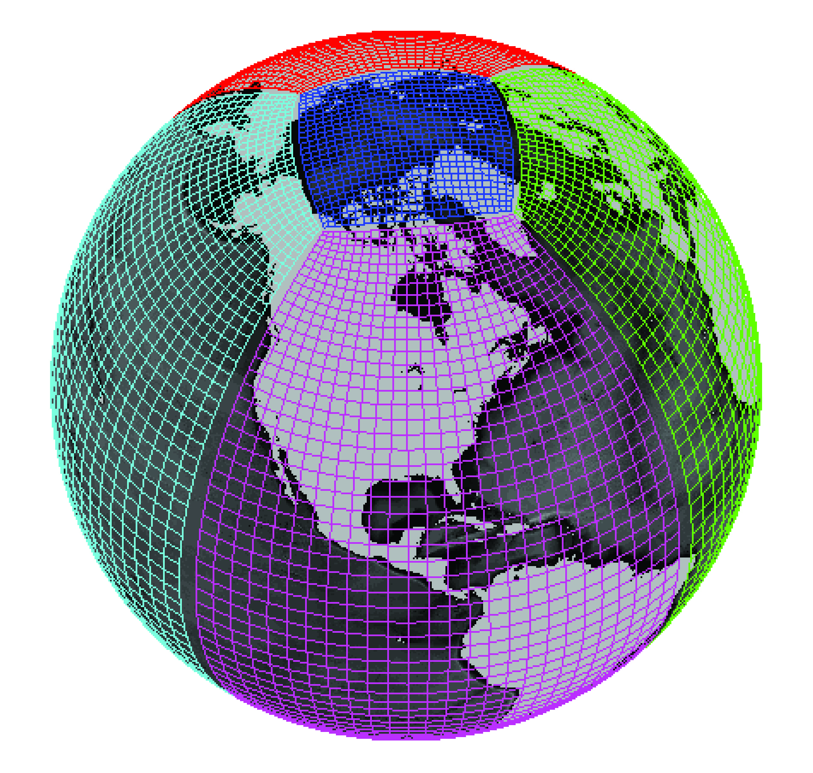
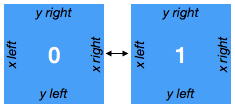
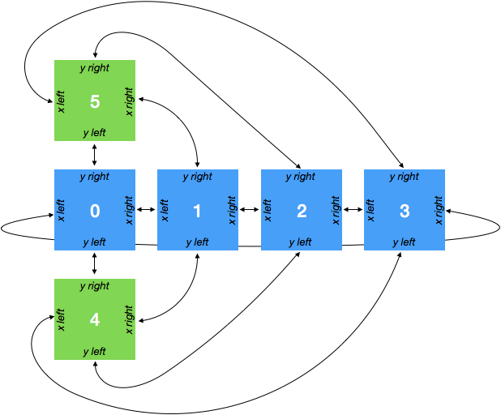
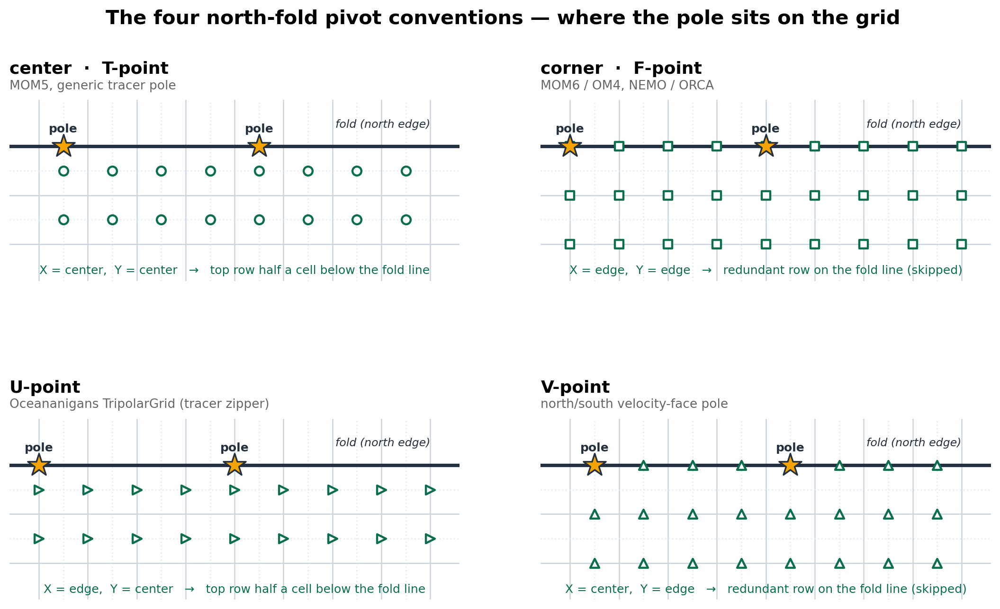
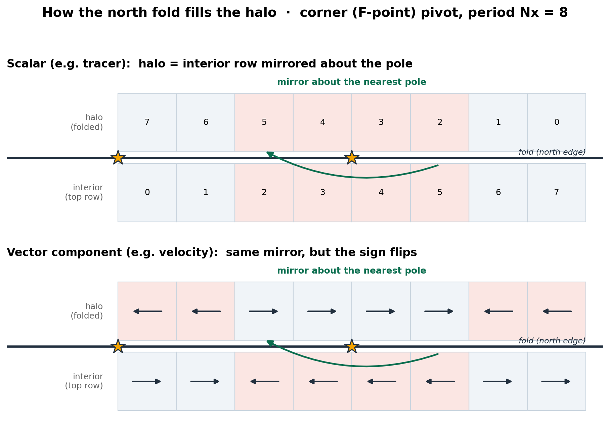

# Grid Topology {#grid-topology}

!!! warning
    The features described in this page should be considered experimental. The
    API is subject to change. Please report any unexpected behavior or
    unpleasant experiences on the
    [github issues page](https://github.com/xgcm/xgcm/issues)

## Faces and Connections

Simple grids, as described on the [Grids](grids.md) page, consist of a
single logically rectangular domain.
Many modern GCMs use more complex grid topologies, consisting of multiple
logically rectangular grids connected at their edges.
xgcm is capable of understanding the connections between these grid
*faces* and exchanging data between them appropriately.



*Example of a lat-lon-cap grid from the MIT General Circulation Model.
Image credit [Gael Forget](http://www.gaelforget.net/).
More information about the simulation and grid available at
https://doi.org/10.5194/gmd-8-3071-2015.*

In order to construct such a complex grid topology, we need a way to tell
xgcm about the connections between faces. This is accomplished via the
`face_connections` keyword argument to the `Grid` constructor.
Below we illustrate how this works with a series of increasingly complex
examples.
If you just want to get the detailed specifications for `face_connections`,
jump down to [Face Connections Spec](#face-connections-spec).

## Examples

### Two Connected Faces

The simplest possible scenario is two faces connected at one side. Consider
the following dataset

```python
import numpy as np
import xarray as xr

N = 25
ds = xr.Dataset(
    {"data_c": (["face", "y", "x"], np.random.rand(2, N, N))},
    coords={
        "x": (("x",), np.arange(N), {"axis": "X"}),
        "xl": (
            ("xl"),
            np.arange(N) - 0.5,
            {"axis": "X", "c_grid_axis_shift": -0.5},
        ),
        "y": (("y",), np.arange(N), {"axis": "Y"}),
        "yl": (
            ("yl"),
            np.arange(N) - 0.5,
            {"axis": "Y", "c_grid_axis_shift": -0.5},
        ),
        "face": (("face",), [0, 1]),
    },
)
print(ds)
```

The dataset has two spatial axes (`X` and `Y`), plus an additional dimension
`face` of length 2.
Let's imagine the two faces are joined in the following way:



We can construct a grid that understands this connection in the following way:

```python
import xgcm

face_connections = {
    "face": {0: {"X": (None, (1, "X", False))}, 1: {"X": ((0, "X", False), None)}}
}
grid = xgcm.Grid(ds, face_connections=face_connections)
grid
```

The `face_connections` dictionary tells xgcm that `face` is the name of the
dimension that contains the different faces. (It might have been called
`tile` or `facet` or something else similar.) This dictionary say that
face number 0 is connected along the X axis to nothing on the left and to face
number 1 on the right. A complementary connection exists from face number 1.
These connections are checked for consistency.

We can now use `Grid.interp` and
`Grid.diff` to correctly interpolate and difference
across the connected faces.

### Two Faces with Rotated Axes

```python
face_connections = {
    "face": {0: {"X": (None, (1, "Y", False))}, 1: {"Y": ((0, "X", False), None)}}
}
grid = xgcm.Grid(ds, face_connections=face_connections)
grid
```

### Cubed Sphere

A more realistic and complicated example is a cubed sphere. One possible
topology for a cubed sphere grid is shown in the figure below:



This geometry has six faces. We can generate an xarray Dataset that has two
spatial dimensions and a face dimension as follows:

```python
ds = xr.Dataset(
    {"data_c": (["face", "y", "x"], np.random.rand(6, N, N))},
    coords={
        "x": (("x",), np.arange(N), {"axis": "X"}),
        "xl": (
            ("xl"),
            np.arange(N) - 0.5,
            {"axis": "X", "c_grid_axis_shift": -0.5},
        ),
        "y": (("y",), np.arange(N), {"axis": "Y"}),
        "yl": (
            ("yl"),
            np.arange(N) - 0.5,
            {"axis": "Y", "c_grid_axis_shift": -0.5},
        ),
        "face": (("face",), np.arange(6)),
    },
)
print(ds)
```

We specify the face connections and create the `Grid` object as follows:

```python
face_connections = {
    "face": {
        0: {
            "X": ((3, "X", False), (1, "X", False)),
            "Y": ((4, "Y", False), (5, "Y", False)),
        },
        1: {
            "X": ((0, "X", False), (2, "X", False)),
            "Y": ((4, "X", False), (5, "X", True)),
        },
        2: {
            "X": ((1, "X", False), (3, "X", False)),
            "Y": ((4, "Y", True), (5, "Y", True)),
        },
        3: {
            "X": ((2, "X", False), (0, "X", False)),
            "Y": ((4, "X", True), (5, "X", False)),
        },
        4: {
            "X": ((3, "Y", True), (1, "Y", False)),
            "Y": ((2, "Y", True), (0, "Y", False)),
        },
        5: {
            "X": ((3, "Y", False), (1, "Y", True)),
            "Y": ((0, "Y", False), (2, "Y", True)),
        },
    }
}
grid = xgcm.Grid(ds, face_connections=face_connections)
grid
```

For a real-world example of how to use face connections, check out the
[MITgcm ECCOv4 example](xgcm-examples/01_eccov4.ipynb).

## Face Connections Spec {#face-connections-spec}

Because of the diversity of different model grid topologies, xgcm tries to
avoid making assumptions about the nature of the connectivity between faces.
It is up to the user to specify this connectivity via the
`face_connections` dictionary.
The `face_connections` dictionary has the following general stucture

```
{'<FACE DIMENSION NAME>':
    {<FACE DIMENSION VALUE>:
         {'<AXIS NAME>': (<LEFT CONNECTION>, <RIGHT CONNECTION>),
          ...}
    ...
}
```

`<LEFT CONNECTION>>` and `<RIGHT CONNECTION>` are either `None` (for no
connection) or a three element tuple with the following contents

```
(<FACE DIMENSION VALUE>, `<AXIS NAME>`, <REVERSE CONNECTION>)
```

`<FACE DIMENSION VALUE>` tells which face this face is connected to.
`<AXIS NAME>` tells which axis on that face is connected to this one.
`<REVERSE CONNECTION>` is a boolean specifying whether the connection is
"reversed". A normal (non reversed) connection connects the right edge of one
face to the left edge of another face. A reversed connection connects
left to left, or right to right.

!!! note
    We may consider adding standard `face_connections` dictionaries for common
    models (e.g. MITgcm, GEOS, etc.) as a convenience within xgcm. If you would
    like to pursue this, please open a
    [github issue](https://github.com/xgcm/xgcm/issues).

## The Bipolar North Fold (Tripolar Grids) {#north-fold}

Many global ocean models (MOM6/OM4, NEMO/ORCA, MOM5, Oceananigans) avoid the
coordinate singularity at the geographic North Pole by displacing it onto land
and pairing it with a second displaced pole. Such grids are called **tripolar**:
they carry three singularities — the ordinary South Pole plus the two Arctic
poles. Logically the grid is still a single rectangular tile, but its **northern
edge folds onto itself** along the **bipolar seam**, the line joining the two
northern poles; the top row is welded to a mirror-image of itself running the
other way.

So the two words describe different things: the *grid* is **tripolar** (three
poles), while the *fold* — this boundary condition — is **bipolar** (its seam
connects the two northern poles). xgcm calls the feature a *north fold*.

Because the fold lives on the upper edge of one tile — not between separate faces —
it is *not* a [face connection](#face-connections-spec). Instead it is requested
as a per-axis `boundary` value on the meridional (fold) axis, with the zonal
(seam) axis marked periodic:

```python
import numpy as np
import xarray as xr
import xgcm

N = 8
ds = xr.Dataset(
    coords={
        "x_c": ("x_c", np.arange(N)),
        "x_g": ("x_g", np.arange(N) - 0.5),
        "y_c": ("y_c", np.arange(N)),
        "y_g": ("y_g", np.arange(N) - 0.5),
    },
)
ds["sst"] = (("y_c", "x_c"), np.cos(2 * np.pi * np.arange(N) / N) + np.zeros((N, 1)))

grid = xgcm.Grid(
    ds,
    coords={
        "X": {"center": "x_c", "left": "x_g"},
        "Y": {"center": "y_c", "left": "y_g"},
    },
    boundary={"X": "periodic", "Y": {"fold": "corner"}},
    autoparse_metadata=False,
)
grid
```

The seam axis is inferred as the axis you **explicitly** mark `"periodic"`. On a
3-D grid you therefore only need to declare the zonal seam (`"X"`) and the fold
(`"Y"`); a vertical axis can be left unspecified and will not be mistaken for the
seam. The inference is only ambiguous if you explicitly mark *more than one*
non-fold axis periodic.

With the fold in place, `interp`, `diff`, `derivative`, and the rest of the grid
operators stitch correctly across the top edge instead of falling back to an
ordinary boundary. To see what the fold actually does, label each cell of the
northern row by its column index and pad a single halo row across the seam — the
halo comes back as the interior row **mirrored about the pole**:

```python
from xgcm.padding import pad

cols = xr.DataArray(np.broadcast_to(np.arange(N), (N, N)), dims=("y_c", "x_c"))
halo = pad(cols, grid, boundary_width={"Y": (0, 1)}).isel(y_c=-1)

print("interior north row (cells labelled by column):", cols.isel(y_c=-1).values)
print("folded halo row    (mirrored about the pole) :", halo.values)
```

Every `Grid` operator that reaches across the northern edge — `grid.diff(ds.sst,
"Y")`, `grid.interp`, `grid.derivative`, … — pads this halo automatically.

### The four pivot conventions

The value of `"fold"` names the **pivot**: the staggered grid position that the
fold's fixed point (the pole) sits on. A C-grid stores variables at four kinds of
position — tracer centers (T), cell corners (F), and the two velocity faces
(U, V) — so there are four conventions, and the seam reflects each field about
the pole that matches *its* position:



| `fold` value | Aliases | Pole position (X, Y) | Pole sits on |
|---|---|---|---|
| `"center"` | `"t"` | center, center | a tracer (T) point |
| `"corner"` | `"f"` | edge, edge | a cell corner (F) point |
| `"u"` | | edge, center | a zonal-velocity (U) face |
| `"v"` | | center, edge | a meridional-velocity (V) face |

The seam is **bipolar**: a periodic reflection has *two* fixed points, half a
domain apart (the stars above). Whether the pole sits on a cell edge or a cell
center in X sets their zonal location; whether it sits on an edge or center in Y
sets, *for each field separately*, whether that field's topmost row lies exactly
*on* the fold line — a redundant row, which xgcm skips — or half a cell below it.
A field's top row is on the line precisely when the field's own Y position
(center or edge) matches the pivot's; so a pivot whose pole is Y-centered
(`center`/`u`) still produces a redundant top row for its center-positioned
fields, not only the Y-edge pivots (`corner`/`v`).

These four exhaust the possibilities — the pivot depends only on whether each
axis lands on a cell center or a cell edge, and a center/edge pair on each of two
axes is four cases. If you would rather name the positions directly than recall
the T/F/U/V vocabulary, pass an explicit `{axis: position}` mapping using your
grid's own axis names; it resolves to the same four. For example
`{"fold": {"X": "center", "Y": "left"}}` is just another way to write `"v"`
(any non-center Y position — `left`, `right`, `inner`, `outer` — counts as an
edge).

### How the halo is filled

To evaluate an operator across the top edge, xgcm pads a northern **halo** by
reflecting the interior about the nearest pole. A **scalar** (tracer, layer
thickness, …) is mirrored as-is; a **vector component** (a velocity, a flux) is
mirrored *and* sign-flipped, because folding the grid rotates the local axes by
180°:



So that vector components flip correctly, pass the partner component via
`other_component`, exactly as for [vector face connections](grids.md). Folding
the same `u` data as a scalar versus as a vector shows the difference — the
vector halo is the scalar halo with the sign reversed:

```python
ds["u"] = (("y_c", "x_g"), np.broadcast_to(np.arange(1, N + 1), (N, N)).astype(float))
ds["v"] = (("y_g", "x_c"), np.zeros((N, N)))  # U-point / V-point components

scalar = pad(ds.u, grid, boundary_width={"Y": (0, 1)}).isel(y_c=-1)
vector = pad(
    {"X": ds.u}, grid, boundary_width={"Y": (0, 1)}, other_component={"Y": ds.v}
).isel(y_c=-1)

print("u folded as a scalar (mirror)            :", scalar.values)
print("u folded as a vector (mirror + sign flip):", vector.values)
```

The same applies to the high-level operators: `grid.diff({"X": ds.u}, "Y",
other_component={"Y": ds.v})` differences the `u` component across the fold with
the sign handled for you.

The fold is applied purely in the padding layer as an indexed gather, so it stays
lazy and works with multi-chunk dask arrays. For a worked example on real model
output from three different codes — including `interp` (surface speed) and `diff`
(horizontal divergence) diagnostics that stay continuous across the seam — see the
[Tripolar fold example](xgcm-examples/05_tripolar_fold.ipynb).

!!! note
    Only the **north** edge folds; the south edge of the fold axis uses an
    ordinary boundary — a per-call `boundary` passed to the operator if given,
    otherwise the construction-time `"south"` mode (default `fill`), set via the
    `"south"` key, e.g. `{"fold": "corner", "south": "extend"}`.
