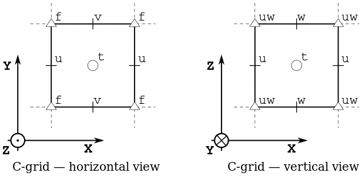

# Summary

Xgcm is a python package whose goal is to enable scientists to analyze
finite-volume datasets easily, efficiently, and accurately.
Finite volume methods are used throughout science and engineering to
discretize and solve partial differential equations, especially in computational fluid dynamics.
Xgcm is not an equation solver--rather, it is a package aimed at analyzing
the *output* of such simulations, i.e. "post-processsing."
Post-processing is important because large-scale simulations are often run
once on supercomputer, producing massive datasets ripe for exploration and
discovery.
Many common simulation codes use legacy Fortran, and their internal routines
are inaccessible in interactive, post-processing workflows using python.
Xgcm enables users to recreate the finite-volume operations used
internally by a simulation within python post-processing code, allowing users
to easily compute quantities such as divergence, curl, etc. in a numerically
faithful way.
Xgcm was inspired by the General Circulation Models (GCMs) of weather,
ocean, and climate science, but could be utilized for other domains, such
as plasma physics or astrophysical modeling, which use similar numerical grids.

# Statement of Need

The Python package Xarray  [@hoyer2017xarray] is, in many ways, an ideal tool for analyzing GCM
data, providing file I/O, convenient indexing and grouping, coordinate-aware data
transformations, and (via Dask, @rocklin2015dask) parallel, out-of-core array computation.
However, GCM data provides a challenge to Xarray's data model: most finite-volume GCMs use
_Arakawa Grids_ [@ARAKAWA1977173], in which different variables are offset (a.k.a. staggered) from one another and situated at different locations with respect to the cell center and edge points.
An example, illustrated in Fig. 1, is the C-grid geometry, which places scalars
(such as temperature) at the cell center and vector components (such as velocity)
at the cell faces.

Xarray has no concept of a grid cell center, face, etc. in its data model.
Xgcm augments xarray with an understanding of these staggered grids and
provides the associated operators for interpolating and differencing variables
from one grid position to another while keeping track of their coordinates.
Xgcm also includes an understanding of grid "metrics," the distance / area /
volume measures which characterize the grid-cell geometry.
By combining the primitive interpolation / difference
operators with the metrics, Xgcm can perform finite-volume integrals and
derivatives in a manner consistent with simulation internals.
Xgcm therefore can serve as a foundation for advanced GCM analytics, such as
tracer, momentum, vorticity, and energy budgets.
Xgcm supports orthogonal curvilinear grids, including complex, multiply-connected
grid topologies such as the cubed-sphere.

# Scientific Applications

Since ``xgcm`` was developed by oceanographers, its main applications have been
in ocean GCM analysis.
Xgcm is most frequently used to compute finite-volume budgets for quantities
like heat, salinity, or chemical concentration.

Some published results include:
- Analysis of kinematic simulations of tracer mixing in the global ocean [@busecke_ocean_2019].
- Analysis of simulations of the southern ocean phytoplankton ecosystem [@uchida2019contribution].
- Analysis of the momentum budget in the equatorial undercurrent [@busecke_ocean_2019].
- Diagnostics of temporal variability the global ocean heat budget in the ECCOv4 state estimate [@tesdal_abernathey_2020].

Xgcm also provides the computational backbone for several downstream tools, including
OceanSpy [@almansi_et_al_2019], a Python package for ocean model
data analysis and visualization and ECCOv4-py [@eccov4py], a tool used
for to postprocess and analyze output from the ECCOv4 state estimate [@forgetECCOv4],
a global ocean model constrained to 25 years of observational data.
The finite volume grid on which the ECCOv4 solution lives is made up of 13 connected tiles
(see Fig. 1, [@forgetECCOv4]) which, due to the orientation of some of the tiles,
can make standard computations challenging.
For example, computing meridional heat transport requires realigning the vector components of
the horizontal heat fluxes on some grid tiles.
Notably, the generic differencing and interpolation operations in xgcm
make computations like this
1. intuitive and transparent within the ECCOv4-py code, and
2. computationally flexible because of integration with Xarray and Dask.

We welcome reports of applications in other domains.

# Acknowledgements

Some Xgcm development has been support by NSF award OAC-1835778 and the Gordon and Betty Moore Foundation.
However, much of the development occurred outside the context of any funded project.

# References
